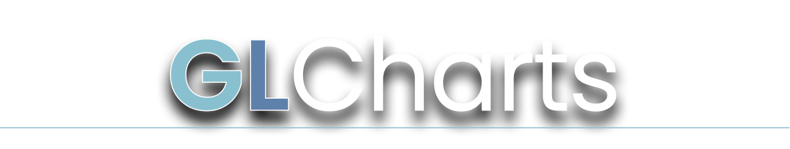
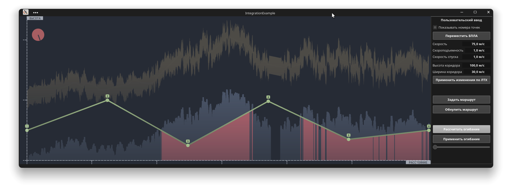

#### **Библиотека для построения и работы с графиками для QT/QML с графическим ускорением**

#### Текущий функционал:

- [x] Построение профиля высот по заданному географическому маршруту

#### **GLCharts::ElevationWidget** - *виджет профиля высот* 

##### Пример интеграции:

##### C++ API

###### 	Инициализация:

- **ElevationWidget** (QObject* `parent`)

  *Конструктор для C++ части виджета. Может быть создан только один раз для одного приложения.*

  *Должен быть вызван до инициализации UI в приложении (для регистрации типов в QML).* 

  - `parent` - *родительский объект для С++ части виджета.*

- void **linkWithQML**(QQuickItem* `rootObject`)

  *Связывает QML и C++ части виджета в контексте целевого приложения.*

  *Эта функция  должна быть вызвана после инициализации QML и UI для линковки с объектами в QML.*

  <!--Без вызова этой функции виджет не будет инициализирован.-->

  - `rootObject` - *указатель на Item в QML, в котором размещен виджет профиля высот.*

###### 	Маршрут:

- list<GeoPoint> **getRoute**()

  *Возвращает текущий редактируемый путь из виджета в виде списка готочек с высотой относительно борта и скоростями.*

- void **setRoute**(const list<GeoPoint>& `route`)

  *Задает список точек в виджет*

  - `route` - *список геоточек (см. описание класса ниже) с высотой относительно борта и скоростями.*

- void **setUAVPosition**(const QGeoCoordinate& `position`)

  *Задает географические координаты БПЛА для расчета высоты для точек.*

  - `position` - *геокоординаты БПЛА. Высота в них не будет учитываться.*

- void **setUAVPosition**(double `latitude`, double `longitude`)

  *Перегрузка для предыдущей функции.*

  - `latitude` - *географическая широта БПЛА,*
  - `longitude` - *географическая долгота БПЛА.*

- bool **isIntersecting**()

  *Возвращает `TRUE`, если заданный маршрут пересекает рельеф хотя бы в одной точке.*

- bool **isValid**()

  *Возвращает `FALSE`, если в папке с профилями высот отсутствуют нужные тайловые карты.*

###### 	Коррекция по ЛТХ:

- void **setClimbRate**(float `rate`)

  *Задает максимально допустимую скороподъемность.*

  `rate` - *скорость в м/с.*

- void **setDescendRate**(float `rate`)

  *Задает максимально допустимую скорость спуска.*

  - `rate` - *скорость в м/с.*

- void **setGlobalVelocity**(float `velocity`)

  *Задает константную скорость для вычисления ЛТХ/огибающей. Скорость будет использована при: вычислении огибающей (точкам результата вычисления огибающей будет задана эта скорость в качестве скорости по умолчанию) или в случае, когда скорость в точке пути невалидна (например, задано отрицательное значение). Тогда этой точке будет присвоена скорость по умолчанию.*

  - `velocity` - *скорость в м/с*.

- void **applyMetricsCorrection**()

  *Применяет к текущему редактируемому пути коррекцию по ЛТХ.*

- bool **isMatchingMetrics**()

  *Возвращает `TRUE`, если редактируемый список точек удовлетворяет требованиям по ЛТХ.*

###### 	Огибающая рельефа:

- void **setEnvelopeMinimumAltitude**(float `altitude`)

  *Задает предпочитаемую высоту для коридора огибания.*

  - `altitude` - *высота в метрах*.

- void **setEnvelopeCoridorSize**(float `distance`)

  *Задает предпочитаемый размер коридора огибания.*

  - `distance` - *расстояние между нижней и верхней границей профиля огибания в метрах.*

- void **estimateEnvelope**()

  *Вычисляет маршрут огибания и отображает его на экране.*

- void **applyEnvelopeCorrection**()

  *Применяет вычисленный маршрут огибания к текущему загруженному маршруту.*

###### 	Сигналы:

- **routeChanged**()

  *Сигнал, сообщающий об изменении набора точек в виджете.*

- **intersectingStateChanged**(bool `intersects`)

  *Сигнал, сообщающий, что состояние пересечения изменилось.*

  - `intersects` - состояние пересечения.

- **processFinished**()

  *Сигнал посылается при завершении вычислений в виджете.*

- **envelopeCalculated**(bool `state`)

  *Сигнал посылается при изменении состояния расчёта огибающей*

  - `state` - *состояние расчета огибающей.*

###### 	Класс GeoPoint:

- **GeoPoint**(const QGeoCoordinate& `coordinate`, float `velocity`)

  *Создает точку с заданными координатами и скоростью.*

  - `coordinate` - *координаты точки в виде `QGeoCoordinate`*,
  - `velocity` - *скорость точки (в м/с)*.

- **GeoPoint**(double `latitude`, double `longitude`, float `altitude`, float `velocity`)

  *Создает точку с заданными координатами и скоростью.*

  - `latitude` - *географическая широта точки*,
  - `longitude` - *географическая долгота точки*,
  - `altitude` - *высота точки относительно борта*,
  - `velocity` - *скорость точки (в 1 м/с)*.

- **GeoPoint**()

  *Создает невалидную точку с невалидными координатами и скоростью в -1 м/с.*

- QGeoCoordinate **coordinate**()

  *Возвращает географические координаты точки.*

- void **setCoordinate**(const QGeoCoordinate& `other`)

  *Задает географические координаты точки.*

- float **velocity**()

  *Возвращает скорость точки в м/с.*

- void **setVelocity**(float `other`)

  *Задает скорость точки в м/с.*

- double **latitude**()

  *Возвращает географическую широту точки.*

- void **setLatitude**(double `other`)

  *Задает широту точки.*

- double **longitude**()

  *Возвращает географическую долготу точки.*

- void **setLongitude**(double `other`)

  *Задает долготу точки.*

- float **altitude**()

  *Возвращает высоту точки в метрах относительно уровня борта.*

- void **setAltitude**(float `other`)

  *Задает высоту точки.*

- bool **isValidElevationTilePoint**()

  *Возвращает `TRUE`, если эта точка находится внутри валидной карты высот. Возвращает `FALSE`, если для этой точки не существует тайла карт высот.*

  

##### QML API

- `color` **s_BackgroundColor** - *цвет фона для виджета*.

- `color` **s_ForegroundColor** - *цвет элементов интерфейса для виджета*.

- `color` **s_ProfileColor** - *цвет профиля высот*.

- `color` **s_RouteColor** - *цвет маршрута БПЛА*.

- `color` **s_WarnColor** - *цвет предупреждений в виджете*.

- `color` **s_ErrorColor** - *цвет критических ошибок на профиле*.

- `color` **s_InfoColor** - *цвет информации*.

- `string` **s_FontFamily** - *шрифт, используемый в интерфейсе*.

- `bool` **b_ShowIndexes** - *состояние отображения индексов у точек на профиле*.

- `vector4d` **vec_Offsets** - *вектор отступов для графика от краев виджета. x - отступ слева, y - отступ сверху, z - отступ справа, w - отступ снизу.*.

  